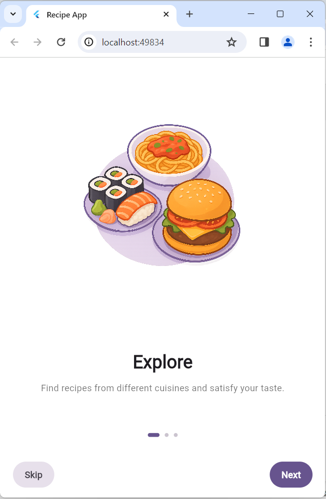
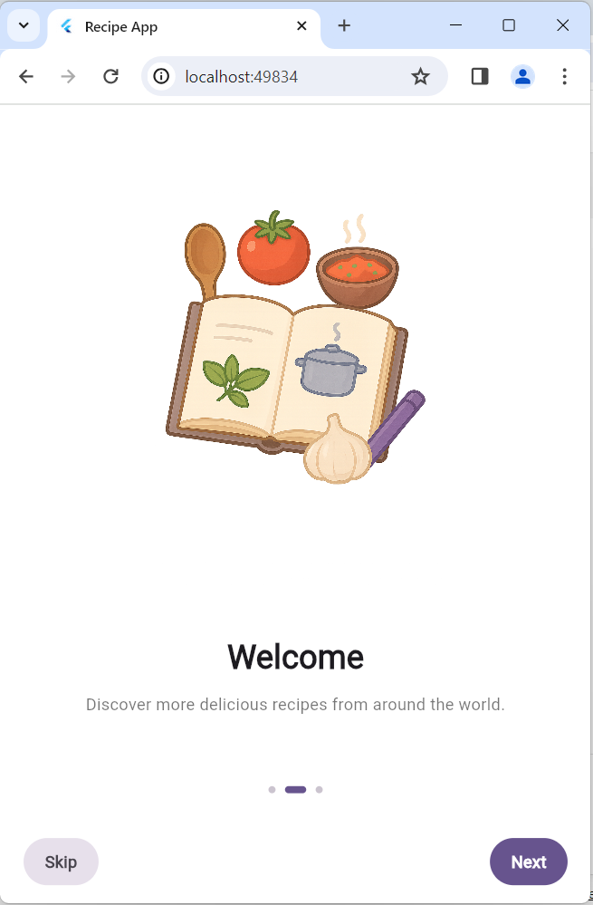
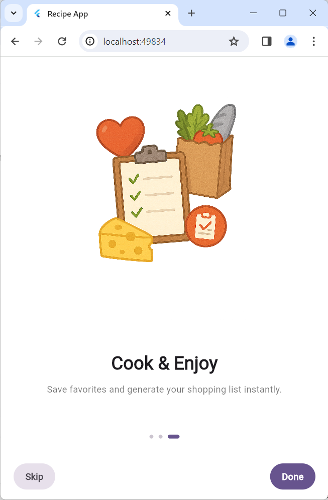
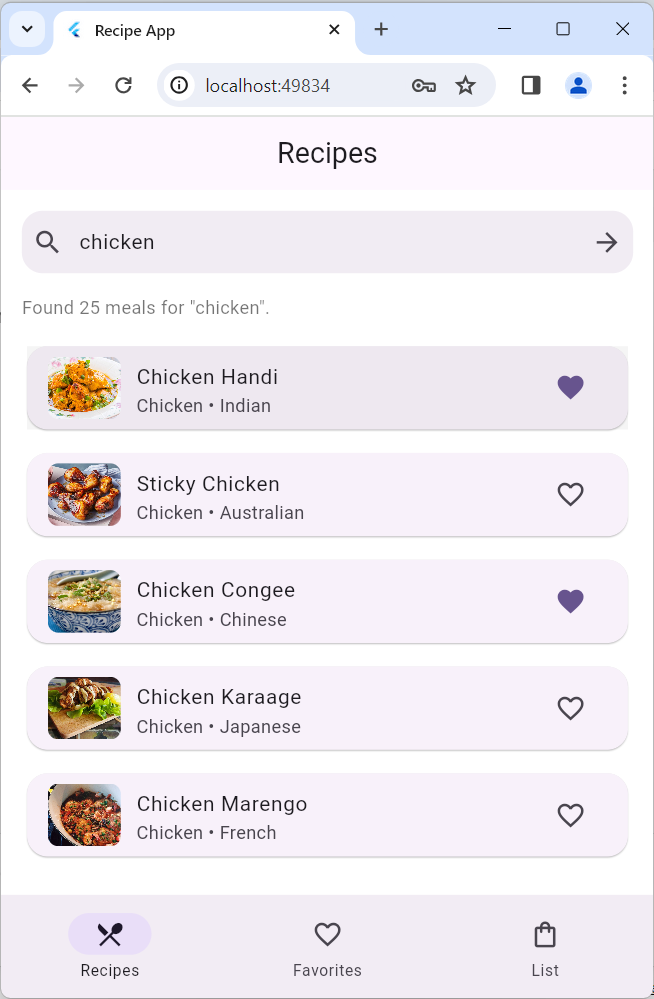
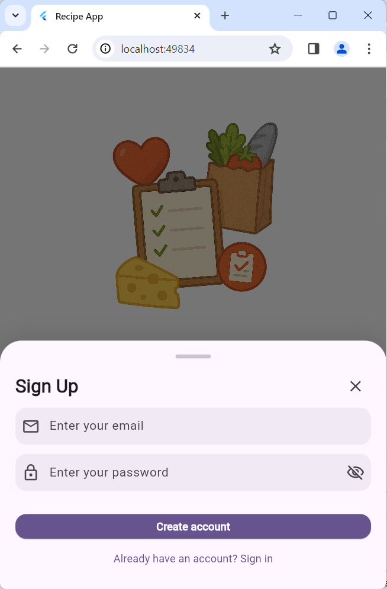
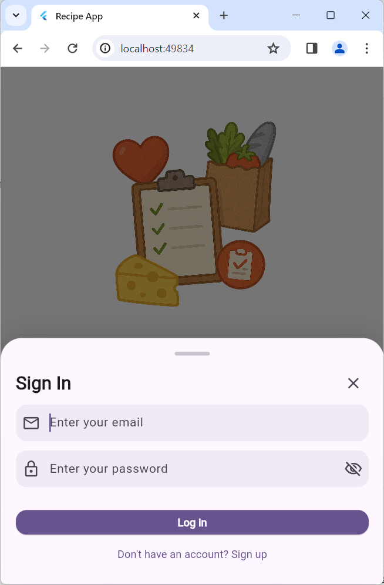
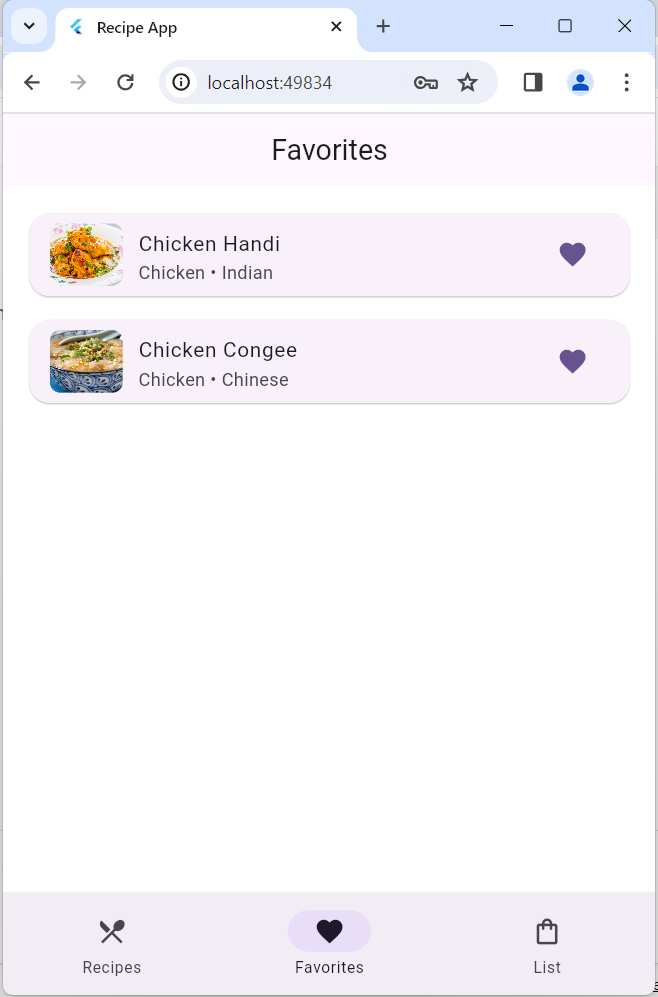
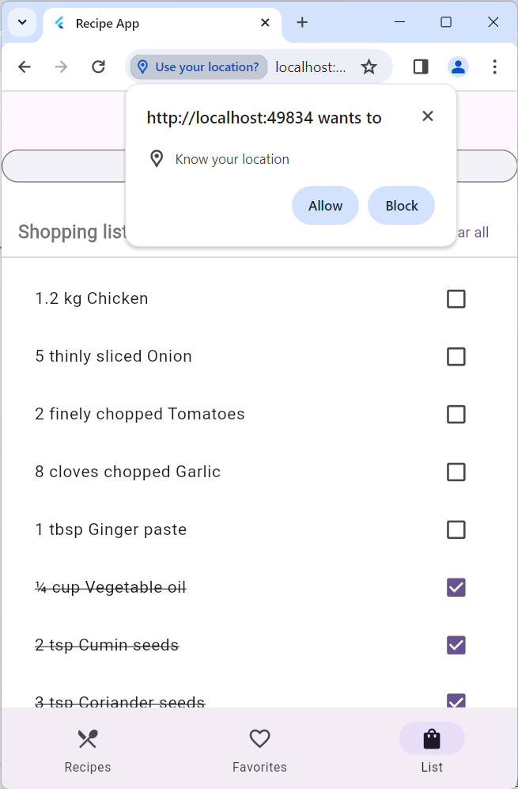
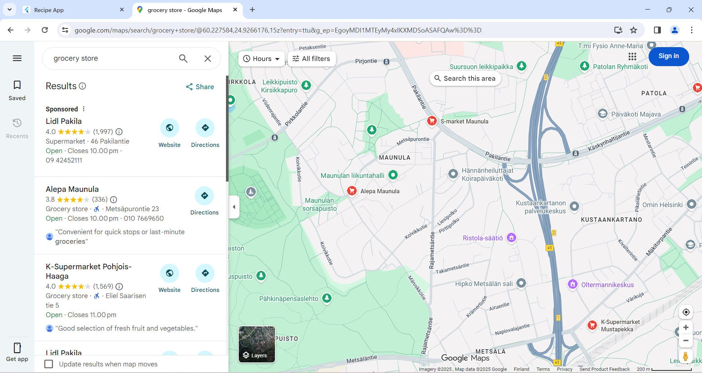

# RecipeAppFlutter

A Flutter-based mobile app for browsing recipes, saving favorites, and managing a shopping list with basic location-based helper features.

This project was created as a coursework assignment for a mobile development / Flutter course.

---

## Overview

**RecipeAppFlutter** lets users:

- search recipes from the web using a public REST API (TheMealDB);
- browse results in a clean list view;
- open a detailed recipe view with image, ingredients and instructions;
- save recipes to **favorites**;
- add ingredients from a recipe to a personal **shopping list**;
- mark shopping list items as done (checkbox);
- share a recipe as text to other apps (e.g. messaging apps);
- sign up / sign in with email and password (Firebase Auth);
- keep favorites and shopping list in sync across devices (Cloud Firestore);
- from the shopping list view, tap **“Find nearby grocery store”** to open a maps app showing grocery stores near the user’s current location.

On first launch, the user sees a short **onboarding** flow (3 screens).  
After that, a **Sign up / Sign in** bottom sheet is shown. Once authenticated, the main app with a bottom navigation bar opens:
- **Recipes**
- **Favorites**
- **Shopping list**

---

## Features

- 🔎 Recipe search via TheMealDB API  
- 📄 Recipe detail screen (image, category, area, ingredients, instructions)  
- ⭐ Favorites stored per user  
- 🛒 Shopping list with checkboxes and swipe-to-delete  
- 📤 Share recipe as plain text using the system share dialog  
- 🔐 Email + password authentication with Firebase Auth  
- ☁️ Per-user data in Firebase Cloud Firestore (favorites + shopping list)  
- 📍 “Find nearby grocery store” button using device location and maps  
- 🎨 Simple onboarding screens and clean Material 3 UI

---

## Tech Stack

- **Framework:** Flutter 
- **Language:** Dart
- **Backend services:** Firebase (Auth + Cloud Firestore)
- **Public API:** [TheMealDB](https://www.themealdb.com/)

### Main packages

- [`http`](https://pub.dev/packages/http) – REST API calls to TheMealDB  
- [`shared_preferences`](https://pub.dev/packages/shared_preferences) – local storage for shopping list (and optionally favorites)  
- [`firebase_core`](https://pub.dev/packages/firebase_core) – Firebase initialization  
- [`firebase_auth`](https://pub.dev/packages/firebase_auth) – email/password authentication  
- [`cloud_firestore`](https://pub.dev/packages/cloud_firestore) – per-user favorites and shopping list  
- [`share_plus`](https://pub.dev/packages/share_plus) – sharing recipe text to other apps  
- [`geolocator`](https://pub.dev/packages/geolocator) – getting device location  
- [`url_launcher`](https://pub.dev/packages/url_launcher) – opening Google Maps (or other map apps)  
- [`cupertino_icons`](https://pub.dev/packages/cupertino_icons) – icon set

---

## Screenshots

> Screenshots are stored under `docs/screenshots/`.

### Onboarding





### Recipe search



### Sign Up/Sign In




### Favorites



### Shopping list & nearby stores





---

## Project Structure

```text
lib/
  main.dart                # App entry point, theming, Firebase init
  models/
    meal.dart              # Meal model (API + favorites)
    shopping_item.dart     # Shopping list item model
  services/
    meal_api_service.dart  # TheMealDB API client
    auth_service.dart      # Firebase Auth wrapper
    firestore_service.dart # Cloud Firestore wrapper
    local_storage_service.dart # SharedPreferences wrapper
    location_service.dart  # Geolocator + maps launcher
  screens/
    onboarding_screen.dart # Intro screens
    home_screen.dart       # Bottom navigation + main tabs
    meal_detail_screen.dart# Recipe details + add to shopping list
  widgets/
    signup_sheet.dart      # Sign up / Sign in bottom sheet
    ...                    # Other reusable widgets
```

---

## Getting Started

### Prerequisites

- Flutter SDK installed 
- Android Studio / Android SDK or other target (Android emulator, physical device, or web)
- A working Firebase project (already configured in this repo via firebase_options.dart)

### Install dependencies

```text
flutter pub get
```

### Run the app

```text
flutter run
```

By default, the app is configured to use a Firebase project via `firebase_options.dart`. If you want to use your own Firebase project, you can re-run:

```text
flutterfire configure
```
and replace the generated `firebase_options.dart`.

---

## Data & Networking

- Recipes are fetched from **TheMealDB** public API via HTTP.
- User authentication and per-user data (favorites + shopping list) are stored in **Firebase**:
   - `users/{uid}/favorites` 
   - `users/{uid}/shoppingList`
- Some data is additionally cached locally using `shared_preferences`.

---

### License

This project was created for educational purposes as part of a university course.
Please do not use it as-is in production without reviewing and adapting it to your own needs.
